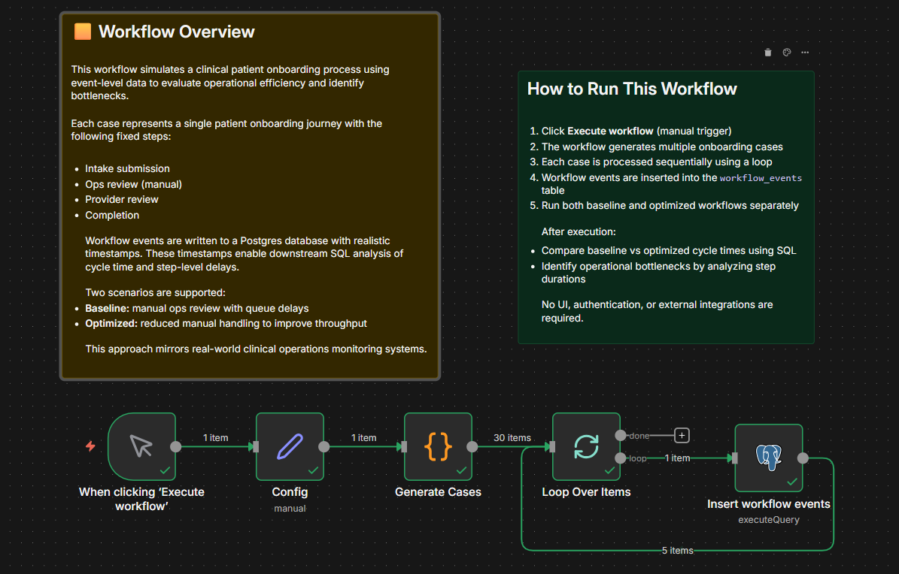

# Clinical Workflow Optimization Simulator – Patient Onboarding 🩺🩺🩺

This project simulates a clinical patient onboarding workflow using event-level
data to identify operational bottlenecks and measure the impact of workflow
optimization.

The goal is to demonstrate how clinical operations teams can use workflow
telemetry to measure cycle time, detect inefficiencies, and validate
improvements before deploying changes to production systems.

---

## Workflow Modeled

Each case represents a single patient onboarding journey with the following
fixed steps:

1. Intake submitted  
2. Ops review (manual)  
3. Provider review  
4. Completion  

Two scenarios are simulated:

- **Baseline:** manual ops review with queue delays
- **Optimized:** reduced manual handling and faster handoffs

Workflow events are written to a Postgres database with realistic timestamps,
enabling cycle time and step-level bottleneck analysis.

---

## Key Findings

- Ops review was the primary bottleneck in the baseline workflow
- Average ops review time decreased by approximately **33%** after optimization
- End-to-end onboarding cycle time improved by approximately **11–15%**
- Automation reduced manual queue delays and improved overall throughput

These results demonstrate how small operational changes can have measurable
impact on patient onboarding efficiency.

---

## Architecture

- **Workflow orchestration:** n8n  
- **Data storage:** Supabase (Postgres)  
- **Analysis:** SQL (cycle time & bottleneck queries)

 ## How to Run

1. Import the baseline or optimized workflow JSON into n8n
2. Click **Execute workflow** (manual trigger)
3. The workflow generates multiple onboarding cases
4. Events are inserted into the `workflow_events` table
5. Run the provided SQL queries to analyze results

No UI, authentication, or external integrations are required.
